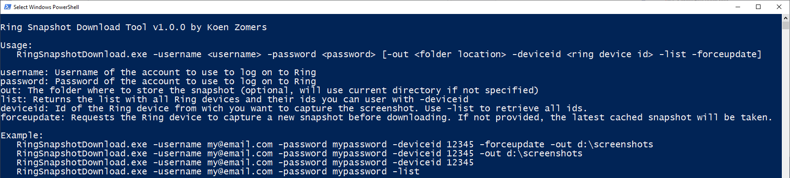
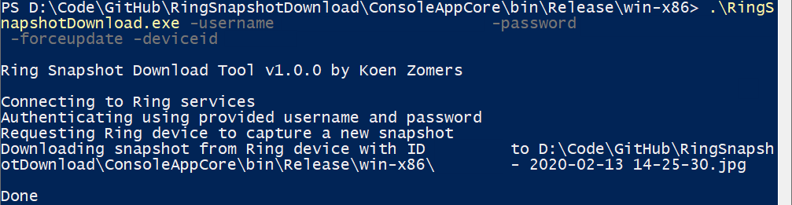
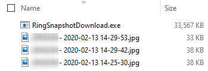

[![licence badge]][licence]
[![stars badge]][stars]
[![forks badge]][forks]
[![issues badge]][issues]

[licence badge]:https://img.shields.io/badge/license-Apache2-blue.svg
[stars badge]:https://img.shields.io/github/stars/koenzomers/RingSnapshotDownload.svg
[forks badge]:https://img.shields.io/github/forks/koenzomers/RingSnapshotDownload.svg
[issues badge]:https://img.shields.io/github/issues/koenzomers/RingSnapshotDownload.svg

[licence]:https://github.com/koenzomers/RingSnapshotDownload/blob/master/LICENSE.md
[stars]:https://github.com/koenzomers/RingSnapshotDownload/stargazers
[forks]:https://github.com/koenzomers/RingSnapshotDownload/network
[issues]:https://github.com/koenzomers/RingSnapshotDownload/issues

# Ring Snapshot Download Tool
Console application written in .NET 6 compiled for Windows, Raspberry Pi, Linux and macOS which allows for downloading of Ring snapshots to your local machine.

## Version History

[3.0.0.0](https://github.com/KoenZomers/RingSnapshotDownload/releases/tag/3.0.0.0) - Oct 22, 2024

- Updated Session creation APIs to comply with the new Ring APIs.

[2.1.0.0](https://github.com/KoenZomers/RingSnapshotDownload/releases/tag/2.1.0.0) - September 3, 2023

- Modified the error handling while downloading an image slightly

[2.0.0.0](https://github.com/KoenZomers/RingSnapshotDownload/releases/tag/2.0.0.0) - September 3, 2023

- Completely removed the dependance on the Ring API package. Only kept a bare minimum version of the model inside this application to avoid conflicts and parsing issues as much as possible.
- Fixed an issue with the OSX x64 build
- Added an OSX ARM64 build

[1.4.0.0](https://github.com/KoenZomers/RingSnapshotDownload/releases/tag/1.4.0.0) - September 2, 2023

- Added -validateimage option that will check if the downloaded image is valid
- Upgraded to [Ring API v0.5.3.0](https://github.com/KoenZomers/RingApi#version-history)

[1.3.0.0](https://github.com/KoenZomers/RingSnapshotDownload/releases/tag/1.3.0.0) - July 4, 2023

- Upgraded to [Ring API v0.5.2.0](https://github.com/KoenZomers/RingApi#version-history)

[1.2.0.0](https://github.com/KoenZomers/RingSnapshotDownload/releases/tag/1.2.0.0) - September 14, 2022

- Upgraded to [Ring API v0.5.0.1](https://github.com/KoenZomers/RingApi#version-history)

[1.1.1.0](https://github.com/KoenZomers/RingSnapshotDownload/releases/tag/1.1.1.0) - September 14, 2022

- The tool is now compiled against .NET 6 for [future supportability](https://dotnet.microsoft.com/en-us/platform/support/policy/dotnet-core#lifecycle)

[1.1.0.2](https://github.com/KoenZomers/RingSnapshotDownload/releases/tag/1.1.0.2) - July 5, 2021

- Added additional error handling around reading the config file
- Fixed an issue with reading from the config file on non Windows environments

[1.1.0.1](https://github.com/KoenZomers/RingSnapshotDownload/releases/tag/1.1.0.1) - July 5, 2021

- Changed configuration handling as the old method wasn't working well in .NET 5. The settings are now stores in Settings.json in the same folder from where you run the tool. Any parameters you provide will be stored in this config file, so you don't have to supply them again on subsequent runs. This new configuration is not backwards compatible with the previous configuration, so if you're upgrading, log in once by providing your username and password via the commandline and the values will get stored in the new config file.

[1.1.0.0](https://github.com/KoenZomers/RingSnapshotDownload/releases/tag/1.1.0.0) - July 4, 2021

- Updated to .NET 5.0

[1.0.2.0](https://github.com/KoenZomers/RingSnapshotDownload/releases/tag/1.0.2.0) - June 23, 2020

- Bugfix in two factor authentication not working
- Bugfix in the counter potentially not showing the proper amount of devices when using -list
- Added notice if the two factor authentication fails due to too many recent requests for it

[1.0.1.0](https://github.com/KoenZomers/RingSnapshotDownload/releases/tag/1.0.1.0) - April 29, 2020

- Changed some async handling of downloads
- Added check with the Ring API on when the latest available camera capture was taken and use that timestamp in the file so if there is no newer image available, the old one will be overwritten
- Added a one second delay after doing a force refresh to allow the Ring API to fetch an update from the doorbell
- Added -maxretries optional flag which allows specifying how many times to retry fetching the snapshot with 1 second intervals if the Ring API returns an error. This happens when Ring has no recent snapshot of your Ring device on file and it couldn't retrieve a new one from the Ring device yet.
- Updated [Ring API](https://github.com/KoenZomers/RingApi) to [0.4.3.2](https://www.nuget.org/packages/KoenZomers.Ring.Api/0.4.3.2)

1.0.0.1 - February 14, 2020

- Ring 2 doorbells will now also be returned when doing a `-list`

1.0.0.0 - February 13, 2020

- Initial version

## System Requirements

- Either of: Windows x86, Windows x64, Windows ARM (i.e. Windows 10 IoT), Linux ARM (i.e. Raspberry Pi), Linux x64 (any Linux based distribution), Mac OS (Apple devices)
- For all platforms the application is self containing, so it does not need anything else to be installed on the operating system, not even .NET Core

## Usage Instructions

1. Download the ZIP file of the latest version from [releases](https://github.com/KoenZomers/RingSnapshotDownload/releases). Make sure you download the right type for the platform on which you want to run it:
   - Windows 7 SP1 or later, Windows 8.1, Windows 10 version 1607 or later, Windows 11, Windows Server 2012 R2 or later: win-x64.zip (64 bit) or win-x86.zip (32 bit)
   - Linux ARM (i.e. Raspberry Pi): linux-arm.zip (32 bit) or linux-arm64.zip (64 bit)
   - Linux x64 (any Linux based distribution): linux-x64.zip
   - Mac OSX (Apple devices): osx-x64.zip or osx-arm64.zip
2. Extract it to any location on your machine
3. Run RingSnapshotDownload.exe in a Command Prompt or PowerShell window to see the possible parameters and samples

If you want to run this application unattended in i.e. a scheduled daily download script, ensure you run it once manually with your username and password. After this run it will store the refresh token in a file called Settings.json and will run without needing a username, password or two factor authentication token on subsequent runs.

## Current functionality

With this tool in its current state you can:

- Log on once to a two factor authentication enabled Ring account and then have it use the retrieved refresh token to run unattended on subsequent runs
- Download the latest snapshot from your Ring device
- List all Ring doorbells and Ring stickupcams you have available under your Ring account
- Force the Ring device to capture a fresh snapshot
